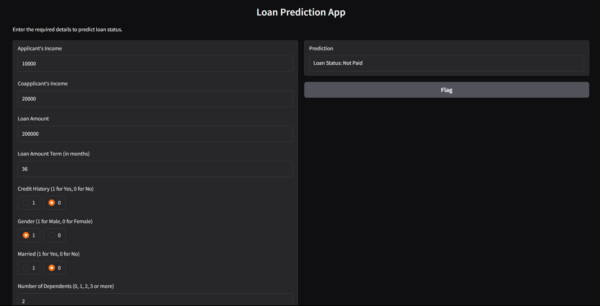
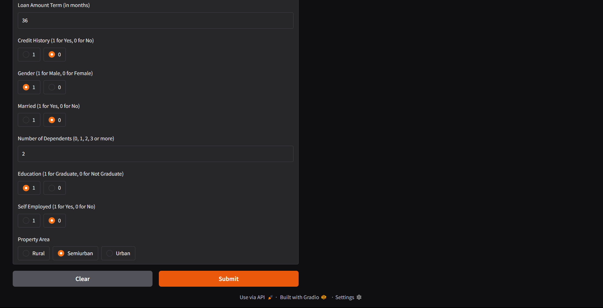

#  Loan Repayment Prediction (Machine Learning)


A complete machine learning pipeline that predicts whether a loan applicant is likely to **repay** or **default** on a loan — automating credit risk assessment with accuracy, speed, and fairness in mind.  
This project delivers **accurate, efficient, and user-friendly loan prediction** through a **Gradio interface** and a live **Streamlit app**.

---

##  Status & Tech Stack


---

##  Overview

Access to credit is a critical enabler of economic activity, yet lenders face significant risk when borrowers default on loan obligations. This project presents a complete machine learning pipeline to predict **loan repayment status** — whether an applicant is likely to repay (`Loan Status: Y`) or not (`Loan Status: N`).

The dataset contains **614 loan applications** with **12 features** including demographic information (Gender, Marital Status, Dependents), financial attributes (Applicant Income, Coapplicant Income, Loan Amount), and credit history.

It helps financial institutions:

-  Reduce credit risk
-  Make faster, data-driven decisions
-  Improve customer experience

---

##  Features

✔️ Multiple ML Models (LR, KNN, SVM, RF, DT, ANN)  
✔️ Real-time prediction with Gradio UI  
✔️ Clean, beginner-friendly codebase  
✔️ Color-coded prediction output ( Green = Approved,  Red = Rejected)  
✔️ Full ML pipeline: EDA → Preprocessing → Modelling → Evaluation → Deployment  
✔️ ROC-AUC curve comparison across all classifiers  
✔️ Statistical testing with `scipy.stats`  

---

##  Technologies Used

- **Python 3.8+**
- **NumPy**, **Pandas** — data handling
- **Matplotlib**, **Seaborn** — visualization
- **Scipy** — statistical testing
- **Scikit-Learn** — preprocessing, classical ML models, metrics
- **TensorFlow / Keras** — Artificial Neural Network
- **imbalanced-learn (SMOTE)** — class balancing
- **Gradio** — interactive prediction interface
- **Streamlit** — web app deployment

---

##  Dataset

| Feature | Description |
|---|---|
| `Loan_ID` | Unique loan identifier |
| `Gender` | Male / Female |
| `Married` | Yes / No |
| `Dependents` | Number of dependents (0, 1, 2, 3+) |
| `Education` | Graduate / Not Graduate |
| `Self_Employed` | Yes / No |
| `ApplicantIncome` | Applicant's monthly income |
| `CoapplicantIncome` | Co-applicant's monthly income |
| `LoanAmount` | Requested loan amount (in thousands) |
| `Loan_Amount_Term` | Repayment term (in months) |
| `Credit_History` | 1 = meets guidelines, 0 = does not |
| `Property_Area` | Rural / Semiurban / Urban |
| `Loan_Status` | **Target** — Y (Repaid) / N (Not Repaid) |

### Data Processing Includes:
- Handling missing values (mode/median imputation)
- Encoding categorical variables
- Square root transformation on skewed income features
- Scaling with `MinMaxScaler`
- Class balancing using **SMOTE** (raw data: ~68% repaid vs ~32% not repaid)

---

##  Machine Learning Workflow

```
Data Loading → EDA → Data Cleaning → Feature Engineering →
SMOTE Balancing → Modelling → Evaluation → Comparison → Deployment
```

### 1️ Exploratory Data Analysis (EDA)
- Distribution plots, count plots, and correlation heatmaps
- Key finding: ~78% of applicants are graduates; **credit history** is the strongest predictor of repayment

### 2️ Preprocessing
- Missing value imputation (mode for categoricals, median for `LoanAmount`)
- Categorical encoding (Label Encoding)
- Feature scaling (MinMaxScaler to [0, 1])
- SMOTE oversampling to balance classes

### 3️ Model Training
Six classifiers were trained and evaluated:

- Linear Regression *(baseline/reference only — unsuitable for classification)*
- Logistic Regression
- K-Nearest Neighbors (KNN)
- Support Vector Machine (SVM with RBF kernel)
- Random Forest (1000 estimators, tuned leaf nodes)
- Decision Tree (tuned depth)
- Artificial Neural Network (ANN with Adam optimizer)

### 4️ Evaluation Metrics
- Accuracy, Precision, Recall, F1-Score
- Confusion Matrix
- ROC-AUC Curves (multi-model comparison)

### 5️ Deployment
Best models deployed via **Gradio** (interactive) and **Streamlit** (web app).

---

##  Model Performance Comparison

| **Model** | **Accuracy (%)** | **Notes** |
|---|---|---|
| Logistic Regression | 72.19 | Good baseline; moderate precision/recall |
| K-Nearest Neighbors | 72.78 | Best k tuned across k=1–20 |
| Support Vector Machine | 71.60 | RBF kernel; competitive precision |
| **Random Forest**  | **79.88** | **Best overall — 1000 estimators, tuned leaf nodes** |
| Decision Tree | 78.70 | Interpretable but prone to overfitting |
| Artificial Neural Network | 74.56 (test) | 10 epochs, Adam optimizer, Binary Crossentropy |

###  ANN Training Summary
- Epochs: **10**
- Optimizer: **Adam**
- Loss: **Binary Crossentropy**
- Final Validation Accuracy: **~79.26%**
- **Test Accuracy: 74.56%**

>  **Random Forest is the top-performing model** with the highest accuracy (~79.9%) and strong precision (~83.7%), making it the most reliable model for deployment.

---

##  Key Findings & Conclusions

1. **Credit History is the most influential feature.** Applicants with a positive credit history are significantly more likely to repay. This aligns with standard credit risk theory.
2. **Class imbalance was a critical issue.** SMOTE successfully balanced the ~68/32 class split, preventing biased model predictions.
3. **Income variables required transformation.** `ApplicantIncome` and `CoapplicantIncome` were heavily right-skewed. Square root transformation improved distribution for distance-sensitive models (KNN, SVM).
4. **Ensemble methods outperform single classifiers.** Random Forest consistently delivered the best results by reducing variance through combined decision trees.
5. **KNN was selected for the Gradio deployment** due to its balance of accuracy and simplicity.
6. **Semiurban property area** showed higher repayment rates — location is a meaningful predictor.
7. **Linear Regression is inappropriate** for binary classification, as confirmed by baseline R² and MSE metrics.

---

##  Recommendations

1. **Prioritize Credit History in risk scoring.** It is the strongest single signal of repayment likelihood.
2. **Use Random Forest for production.** Its robustness to outliers and ensemble nature make it ideal for a production loan approval system.
3. **Collect more diverse data.** The dataset underrepresents female applicants and non-graduates — larger, more balanced training data will improve model fairness.
4. **Consider additional features.** Debt-to-income ratio, employment tenure, and savings history could significantly boost predictive power.
5. **Use median imputation for `LoanAmount`.** Given its right-skewed distribution, this is more robust than mean imputation.
6. **Monitor model drift.** Loan repayment patterns evolve with economic conditions — retrain periodically on fresh data.
7. **Conduct fairness auditing** before deployment to ensure predictions are not systematically biased against protected demographic groups (gender, marital status).

---

##  Getting Started

###  1. Clone the Repository
```bash
git clone https://github.com/Edwinkorir38/loan-repayment-prediction-ml.git
cd loan-repayment-prediction-ml
```

###  2. Install Dependencies
```bash
pip install -r requirements.txt
```

###  3. Run the App

**Gradio App:**
```bash
python Gradio.py
```

**Streamlit App:**
```bash
python app.py
```

---

###  Output Demo

####  Prediction Interface


####  Probability & Analysis


---

##  Project Structure

```
.
├── Data/
│   └── loan_dataset.csv
│
├── Images/
│   ├── image.png
│   └── image-1.png
│
├── notebooks/
│   └── loan_repayment.ipynb
│
├── app.py
├── Gradio.py
├── requirements.txt
├── README.md
└── LICENSE
```

---

##  Live Demo

Try the deployed applications here:

[](https://loan-repayment-prediction-ml-f9em84ghnnxntz2yrvvcf4.streamlit.app/)

[](https://loan-repayment-prediction-ml.onrender.com)

---

##  Contributing

Contributions are welcome! Feel free to open issues or submit pull requests.

---

##  License

Licensed under the [MIT License](LICENSE).

---

##  Contact

For any questions or feedback, feel free to reach out:

- **Name:** Edwin Korir
- **Email:** ekorir99@gmail.com
- **GitHub:** [github.com/Edwinkorir38](https://github.com/Edwinkorir38)
- **LinkedIn:** [linkedin.com/in/edwin-korir-90a794382](https://linkedin.com/in/edwin-korir-90a794382)
